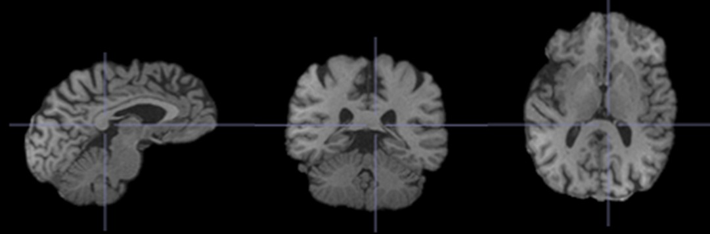
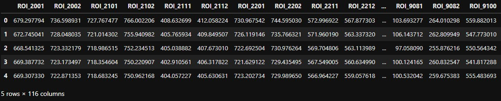
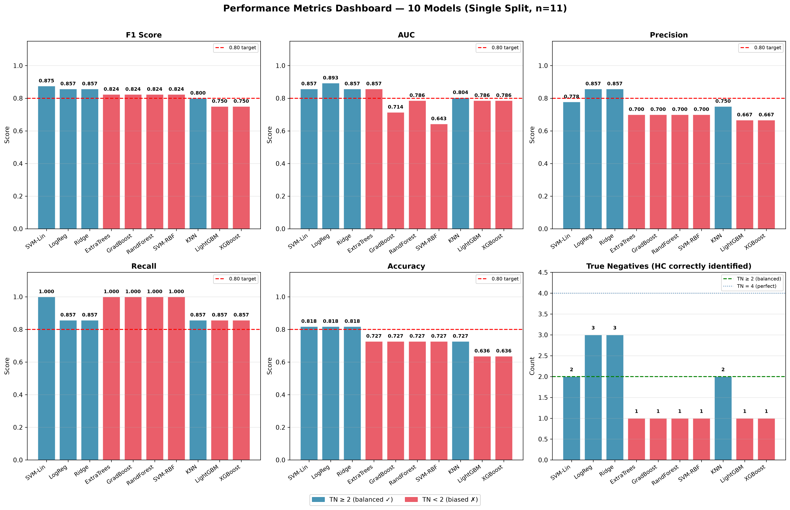
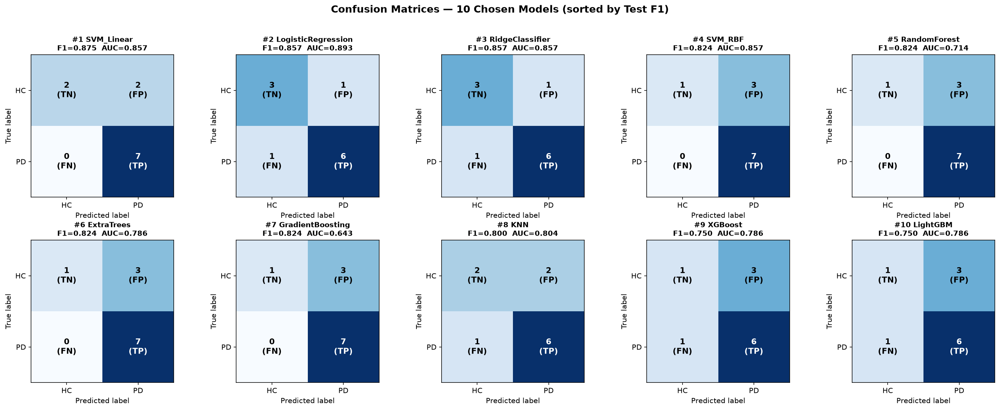
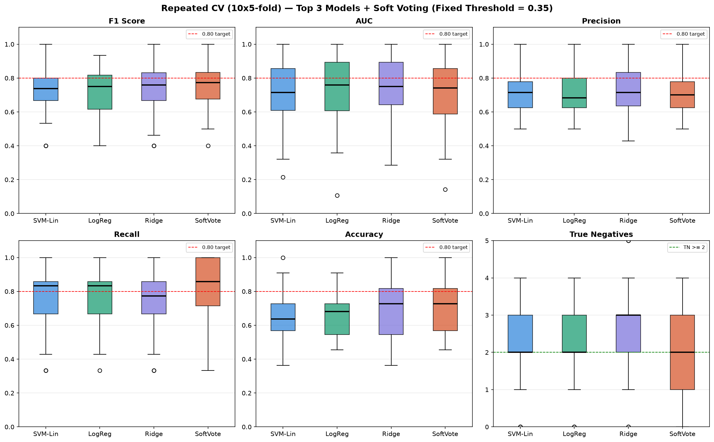
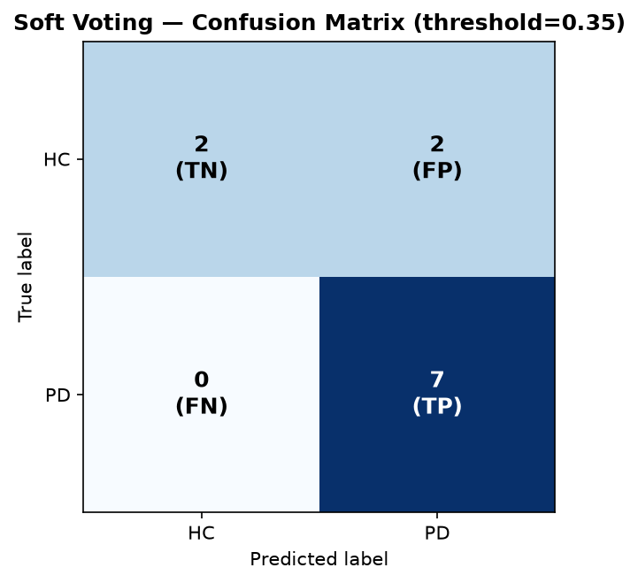
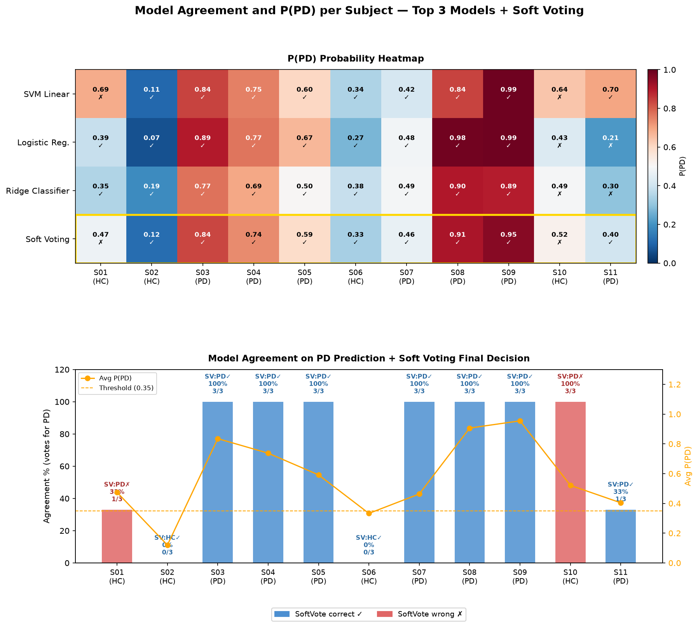
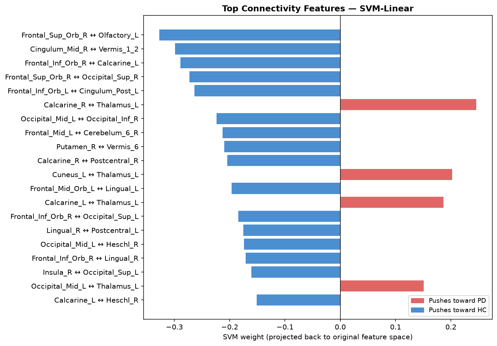
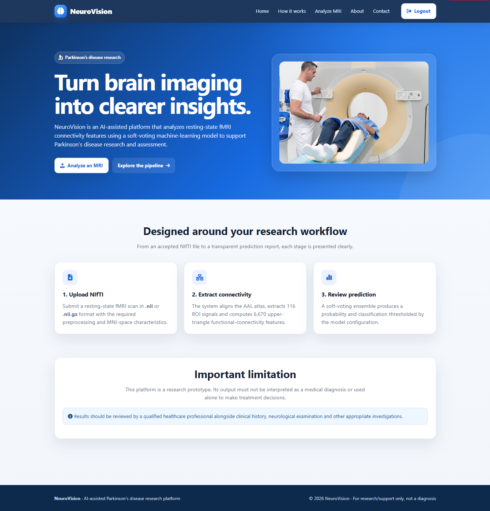

# Parkinson's Disease Classification from Resting-State fMRI

**Final Year Project — B.Sc. Mathematics (Data Science), Saint Joseph University of Beirut**
Supervised by Dr. Michel Abboud

[](https://www.python.org/)
[](https://scikit-learn.org/)
[](https://flask.palletsprojects.com/)
[](./LICENSE)

A complete, end-to-end machine learning pipeline that predicts Parkinson's disease (PD)
from resting-state functional MRI, from raw BIDS data through a deployable web application.

**[Read the full written report (PDF)](./report/Parkinsons_disease_detection_Report.pdf)** —
methodology, all 10 models compared, per-model confusion matrices, and subject-level error analysis.

---

## Table of contents

- [Problem](#problem)
- [Dataset](#dataset)
- [Pipeline overview](#pipeline-overview)
- [Results](#results)
- [Stability check: 50-fold repeated cross-validation](#stability-check-50-fold-repeated-cross-validation)
- [Soft-voting ensemble](#soft-voting-ensemble)
- [What drives the predictions: connectivity feature importance](#what-drives-the-predictions-connectivity-feature-importance)
- [NeuroVision: the deployed web application](#neurovision-the-deployed-web-application)
- [Repository structure](#repository-structure)
- [Reproducing this project](#reproducing-this-project)
- [Limitations & what I'd do differently](#limitations--what-id-do-differently)
- [Tools & technologies](#tools--technologies)
- [Acknowledgments](#acknowledgments)

---

## Problem

Parkinson's disease is currently diagnosed clinically, which depends heavily on
neurologist expertise and typically catches the disease only after motor symptoms
are already noticeable. MRI is accessible and non-invasive, but on its own isn't
reliable enough for diagnosis.

This project asks: **can resting-state fMRI, combined with machine learning, support
earlier and more objective PD detection** — and if so, which brain regions actually
drive that signal?

## Dataset

55 subjects (33 PD, 22 healthy controls) from a public OpenNeuro dataset:
[**ds005892**](https://openneuro.org/datasets/ds005892/versions/1.0.0).
BIDS-formatted T1-weighted anatomical and resting-state BOLD functional scans.

## Pipeline overview

<table>
<tr>
<td width="50%">

**1. Preprocessing** (fMRIPrep, Dockerized)
Skull stripping, motion correction, slice-timing correction, and MNI152 spatial
normalization for every subject.

</td>
<td width="50%">

</td>
</tr>
<tr>
<td width="50%">

</td>
<td width="50%">

**2. Atlas alignment**
The AAL-116 atlas is resampled (nearest-neighbor interpolation, to preserve
integer region labels) onto each subject's native fMRI grid before extraction.

</td>
</tr>
<tr>
<td width="50%">

**3. ROI time series extraction**
For each of 116 brain regions, the mean BOLD signal is averaged across all
voxels belonging to that region, at every time point.

</td>
<td width="50%">

</td>
</tr>
<tr>
<td width="50%">

</td>
<td width="50%">

**4. Functional connectivity**
A 116×116 connectivity matrix is computed per subject (Pearson correlation
between every pair of regions). Only the upper triangle is kept — the matrix
is symmetric — giving **6,670 connectivity features per subject**.

</td>
</tr>
<tr>
<td width="50%">

**5. Modeling**
10 classifiers compared inside one shared pipeline (variance filtering →
robust scaling → SMOTE → mutual-information feature selection → optional
PCA → per-model threshold tuning), all fit *inside* cross-validation so
nothing about a held-out fold ever leaks into feature selection or scaling.

</td>
<td width="50%">

</td>
</tr>
</table>

## Results

10 classifiers (linear, kernel, tree-based, and boosting) were compared on a stratified
80/20 train/test split, with a repair pass for any model that came out biased toward
predicting PD by default (see the full report for the exact selection procedure).





| Model | Test F1 | AUC | Recall |
|---|---|---|---|
| **SVM (linear kernel)** | **0.875** | 0.857 | 1.00 |
| Logistic Regression | 0.857 | **0.893** | 0.857 |
| Ridge Classifier | 0.857 | 0.857 | 0.857 |

Linear models clearly outperformed tree-based and boosting models (Random Forest,
XGBoost, LightGBM) — consistent with functional connectivity data being close to
linearly separable in the reduced feature space, and with boosting's known weakness
on datasets this small (44 training subjects).

## Stability check: 50-fold repeated cross-validation

A single 11-subject test set is small enough that one lucky/unlucky split can swing F1
by ~0.1. The top 3 models were re-evaluated with 10×5-fold repeated stratified CV
(**50 folds total**) for a trustworthy mean ± std instead of one number.



| Model | F1 (50 folds) | AUC (50 folds) | Recall (50 folds) |
|---|---|---|---|
| SVM Linear | 0.738 ± 0.123 | 0.716 ± 0.181 | 0.788 ± 0.164 |
| Logistic Regression | 0.734 ± 0.124 | 0.736 ± 0.194 | 0.769 ± 0.167 |
| Ridge Classifier | 0.727 ± 0.149 | 0.742 ± 0.183 | 0.746 ± 0.189 |
| **Soft-voting ensemble** | **0.757 ± 0.123** | 0.732 ± 0.187 | **0.825 ± 0.162** |

## Soft-voting ensemble

The final model averages predicted PD probabilities from the 3 top linear models,
with a fixed decision threshold of **0.35** (tuned via cross-validation on the
training set only, then held fixed for every later evaluation).

<p align="center">

</p>



The ensemble correctly classified 9/11 held-out test subjects. Both misclassifications
were healthy controls with predicted PD probabilities right at the decision boundary
(0.478 and 0.524) — a clinician would flag these for follow-up rather than treat either
number as decisive.

## What drives the predictions: connectivity feature importance

Performance metrics alone don't answer the more interesting question: **which brain
regions is the model actually using?** SVM-Linear's coefficients were traced back
through PCA and feature selection to the original connectivity features, then mapped
to their AAL-116 region-pair names.



With only 44 training subjects, these specific weights are somewhat unstable — the
broad pattern (which brain systems matter) is more trustworthy than any single
region-pair ranking. See [Limitations](#limitations--what-id-do-differently).

## NeuroVision: the deployed web application

Beyond the research pipeline, this project includes **NeuroVision** — a Flask web
application that takes a raw fMRI upload, runs the full feature-extraction pipeline
(atlas resampling → ROI extraction → connectivity → soft-voting ensemble), and returns
a PD probability with a downloadable PDF report.

<p align="center">

</p>

**Features:**
- Patient upload and management, with authentication and session handling
- Brain-slice preview generation from uploaded scans
- Soft-voting ensemble inference using the exact models from this repo (`soft_voting_deployment/`)
- Downloadable PDF clinical-style report per prediction
- Admin dashboard with search, pagination, and a contact-message inbox

See [`NeuroVision_Final/README.md`](./NeuroVision_Final/README.md) for setup and
environment-variable configuration.

## Repository structure

```
.
├── config.py                          # all paths — edit this, not the scripts
├── notebooks/
│   ├── 01_atlas_resampling_and_roi_extraction.ipynb
│   ├── 02_functional_connectivity_and_feature_matrix.ipynb
│   ├── 03_model_comparison.ipynb
│   ├── 04_soft_voting_ensemble.ipynb
│   └── 05_repeated_cv_stability.ipynb
├── src/                                # script equivalents of the notebooks above
│   ├── 01_extract_roi_timeseries.py
│   ├── 02_build_feature_matrix.py
│   ├── 03_model_comparison.py
│   ├── 04_soft_voting_ensemble.py
│   └── 05_repeated_cv_stability.py
├── derivatives/                        # per-subject ROI time series, connectivity
│                                        # matrices, and the final feature matrix
├── models/
│   └── all_results.pkl                 # fitted pipelines for all 10 models
├── figures/                            # every plot shown in this README
├── report/
│   └── Parkinsons_disease_detection_Report.pdf
├── fmriprep_out/
│   └── README.md                       # explains what belongs here + how to regenerate
├── aal_for_SPM12/                      # AAL-116 atlas files
└── NeuroVision_Final/                  # the deployable Flask web application
    ├── app.py
    ├── soft_voting_deployment/         # the 3 trained models used by the app
    ├── templates/, static/, Images/
    └── README.md
```

## Reproducing this project

```bash
pip install -r requirements.txt
```

**Stage 1 — get preprocessed fMRI data.** Either run fMRIPrep yourself (see
[`fmriprep_out/README.md`](./fmriprep_out/README.md) for the exact Docker command
against the public OpenNeuro dataset), or use the already-computed features in
`derivatives/` and skip straight to modeling.

**Stage 2 — feature extraction** (skip if using `derivatives/` as-is):
```bash
python src/01_extract_roi_timeseries.py
python src/02_build_feature_matrix.py
```

**Stage 3 — model comparison, ensemble, and stability check:**
```bash
python src/03_model_comparison.py
python src/04_soft_voting_ensemble.py
python src/05_repeated_cv_stability.py
```

**Run the web app:**
```bash
cd NeuroVision_Final
pip install -r requirements.txt
python app.py
```

## Limitations & what I'd do differently

- **Small sample.** 55 subjects is small for a 6,670-feature problem even with
  aggressive dimensionality reduction — the 0.12–0.19 std across CV folds is a direct
  symptom of this, not a modeling mistake.
- **Report the single-split number and the repeated-CV number together, always.**
  Early in the project the single-split F1 was reported as *the* result — the repeated
  CV came later specifically because that number alone was misleading with n=11 in
  the test set.
- **A held-out external dataset.** Everything here — train, tune, and evaluate — comes
  from one OpenNeuro cohort. The natural next check is whether the ensemble still
  works on a demographically different acquisition site.
- **Feature-importance stability.** The top-connectivity-features plot reflects one
  fitted model; the natural extension is checking which region pairs appear in the
  top-20 consistently across the 50 CV folds, not just once.

## Tools & technologies

Python · fMRIPrep · Docker · Nilearn · ANTs · scikit-learn · imbalanced-learn ·
XGBoost · LightGBM · Flask · SQLite · ReportLab

## Acknowledgments

Supervised by **Dr. Michel Abboud**, Saint Joseph University of Beirut, Faculty of
Sciences. External guidance on neuroanatomy from **Dr. Hayssam Obeid**.
